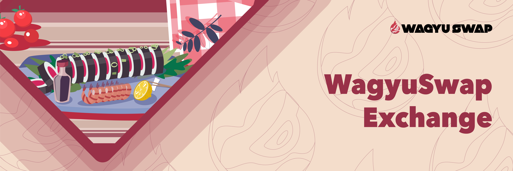

# 🔁 WagyuSwap Exchange

WagyuSwap is an Automated Market Maker \(AMM\), the very first one on Velas Chain which has been clocked as the fastest blockchain in the world. The data doesn't lie and the data tells us that WagyuSwap is the fastest Decentralized Exchange \(DEX\) around!

Decentralized trading in the leading DEX of the Velas ecosystem means you can do several things:

## Swap & Trade tokens

All without having to go through a Centralized Exchange \(ew gross\). All trades on WagyuSwap happen through interactions between our Exchange and your own wallet, so no KYC or invasions of privacy here. 

## Liquidity Pools

But there's a catch! For trading to be possible there has to be enough liquidity in the trading pair of the tokens you want to swap. If nobody has added any liquidity for that pair, it will be impossible to do so.

The solution is simple. Just add Liquidity to WagyuSwap. As a result of fixing these problems, Liquidity Providers will get LP tokens which will yield them a share of the trading fees on the platform.

## Yield Farming

Liquidity Providers can earn $WAG  by locking their LP tokens into a smart contract. This added incentive means to address the risk of [impermanent loss](https://trustwallet.com/blog/what-is-impermanent-loss) that is part and parcel of providing liquidity in a DEX. \(Please remember to always do your own research.\)

## Staking Pools

Don't like the risk of becoming a LP? No problem. Our chefs have made Staking Pools available. These are simpler: you just stake $WAG to earn $WAG.

