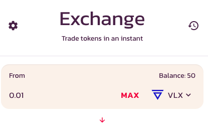
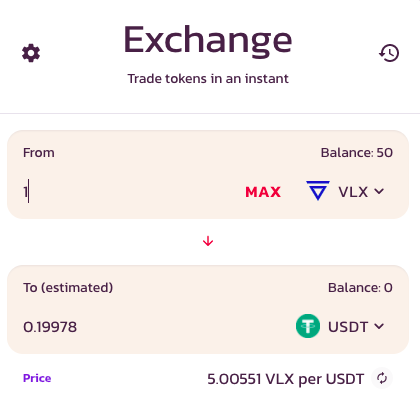
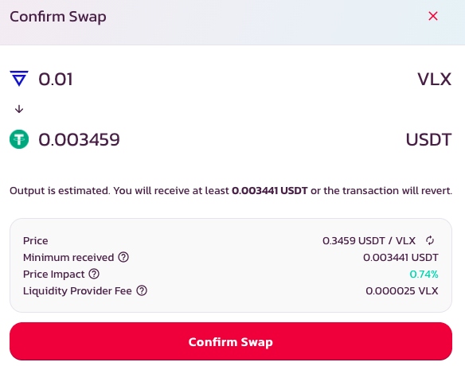

# How to Trade

## Getting set up to trade

Before you can trade, you will need a wallet that is compatible with Velas \(click [here](https://tokenmagic.app/#/) and add "Velas"\) and VEP20 tokens.

## Trading on the WagyuSwap exchange

Go to the Exchange Page and click Unlock Wallet and make sure you're on the Velas network. 

Click on the dropdown menu in the "From" section to choose the token you want to trade, after ensuring it's one of the tokens you actually hold.

Use the "To" field to determine the token you want to trade to and type in the desired amount. This is about as easy as boiling an egg, folks.

The token amount in the "From" section is then estimated automatically, and vice-versa. 

After making sure you're happy with the numbers, click the **Swap** button. 

A new window with more detailed information will pop up. Once again, check if you're happy that the details are correct and click the Confirm Swap button. At this point, your wallet will require you to confirm the action.

_Et voilá!_ 

You are done!

