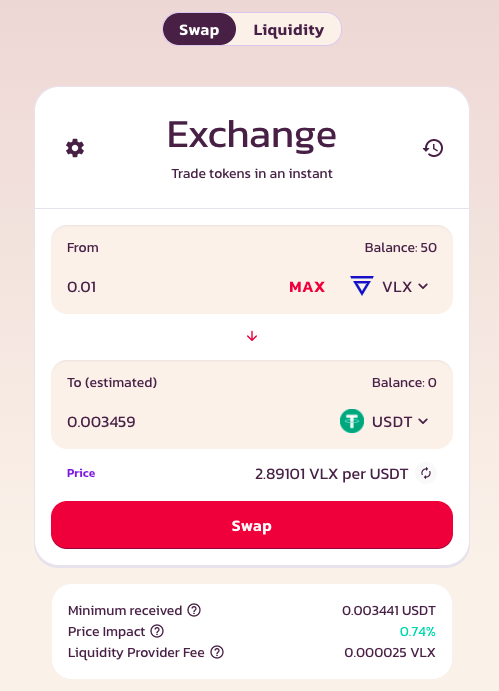

# Token Swaps

WagyuSwap token swaps are simply a mechanism to trade one VEP20 token for another by using our automated liquidity pools.

When you swap a token on the exchange you will pay a 0.25% trading fee**.** Here is how those fees are utilized:

0.17**%** - Sent to liquidity providers.

0.03**%** - Sent to the WagyuSwap Treasury.

0.05**%** - Used to buy WagyuSwap to burn.

