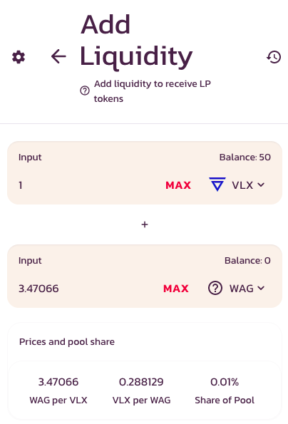

# 🏊 Liquidity Pools

When you add  tokens to a WagyuSwap Liquidity Pool you will receive LP tokens that will allow you to share in the fees.

## LP Tokens

If you deposit VLX and WAG tokens you will receive VLX-WAG LP tokens which will represent your portion of the VLX-WAG Liquidity Pool.

The funds deposited will be redeemable at any time. All you need to do is remove your liquidity.

## Liquidity Providers earn trading fees

When traders use your liquidity pool, you earn a share of the fees.

If your pair is traded on WagyuSwap, the trader pays a 0.25% fee, of which 0.17**%** is subsequently added to the respective Liquidity Pool.

For added gains, you can also farm your LP tokens for some sizzling yield on our Farms all while still earning your 0.17% trading fee.

