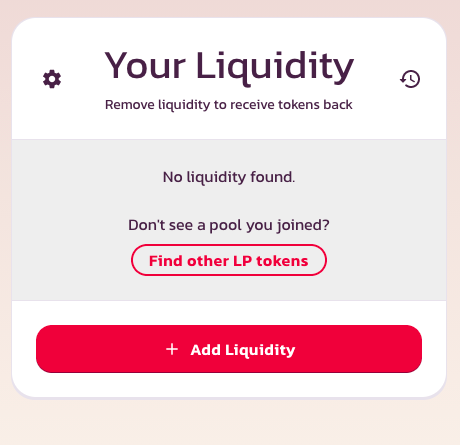
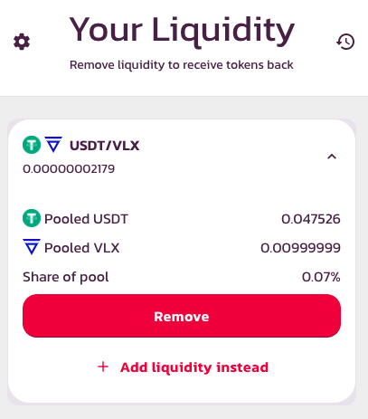
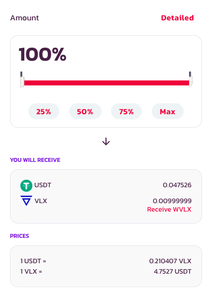
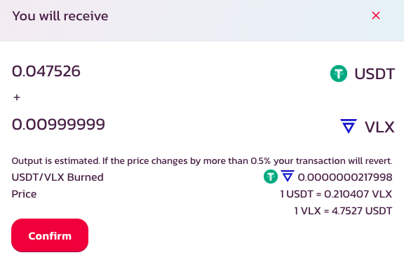

# How to Add & Remove Liquidity

**How to add liquidity**

You’ll need to add both tokens of the trading pair you'd like to provide liquidity for, with the limit to the liquidity you can provide being the lowest USD value of the two tokens.

Feel free to use our exchange to get your desired tokens. Once you have them, follow these steps:

Go on the Liquidity page and click the "Add Liquidity" button.

Hit ‘Select a currency’ for both fields, pick the tokens you'd like to add liquidity for, and the amount for one in the relevant "Input" field. The other amount will appear instantly.

After you click the "Approve" button, your wallet will require you to confirm your approval. When the "Supply" button appears, click it.

If you're happy with the rewards displayed on the window that appears, hit "Confirm Supply" and confirm the action in your wallet.

You'll then see your balance of LP tokens at the bottom of the page.

Want to add more liquidity? Just repeat the steps above!

## **Removing liquidity**

Go on the Liquidity page and click on your pair under “Your Liquidity”

After you hit "Remove" a new window will appear, where you can choose the & you want to remove. Once you're satisfied that you've made the right choice, hit "Approve" and confirm the action in your wallet.

After double-checking the amount displayed in the window that pops up, click "Confirm" and approve the action in your wallet.

You'll then see your balance of LP tokens at the bottom of the page.

