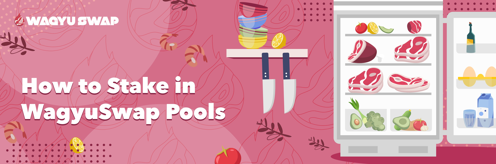
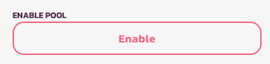
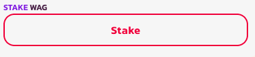
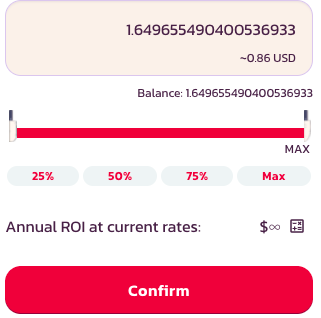
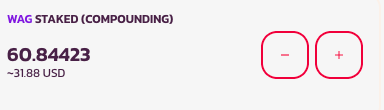

# How to Stake

If you think Yield Farming is too complicated and you'd rather go with something simpler, then Sizzle Pools are perfect for you.

Follow the instructions below to learn how you can make your $SWAG work for you.

## **Choose your Sizzle Pool**

After ensuring your wallet is connected and you've picked the right network, choose which Sizzle Pool you'd like to stake your $WAG in.

Let's look at our first two pools before moving on to the process of staking.

How are **Auto $WAG** and **Manual $WAG** different? It's simple. 

The **Auto $WAG** pool works like a Vault where the users' rewards are re-staked automatically as they're accrued to give you instant compounding.

The **Manual $WAG** pool works exactly the same but, as its name indicates, the users have to manually re-stake the rewards they harvest for them to compound.

All Sizzle Pools our Chefs choose to add in the future will go through the following process.

After you have chosen your preferred Pool, click on it and hit the "Expand" button before confirming the action in your wallet.

By clicking the "Stake" button that now appears you will open the staking menu.

Type in your chosen amount or slide the knife to choose how much $WAG you want to stake. Then, hit "Confirm" and do the same on your wallet.

You have now staked your $WAG! 

### **Adding and removing $WAG**

Adding and removing $WAG to a pool is incredibly easy. Just click on your chosen pool and click on "+" or "-" depending on what you'd like to do.

Please note that unstaking from the Auto $WAG pool has a fee of 0.1% if you unstake  72 hours into having staked it. 

The staking menu will appear. After you have chosen how much you'd like to add or remove, click on "Confirm" and confirm that action in your wallet as well

That's it. You are now a master of WagyuSwap Sizzle Pools. 

Enjoy the meal!

