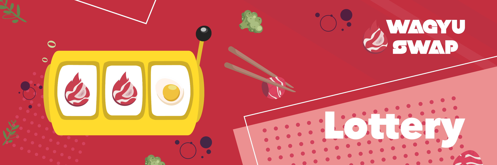
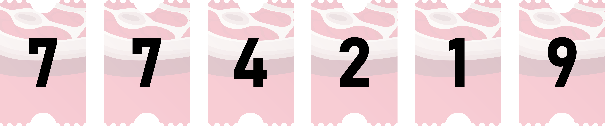
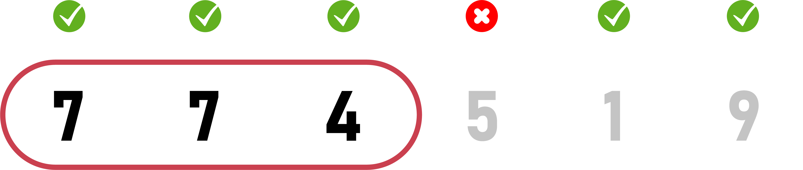
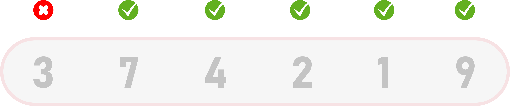

# 🎰 WagyuSwap Lottery

Participating in the WagyuSawp Lottery gives you a chance to win HUGE prizes!\
\
It's straightforward while being completely fair, plus you can enter as often as you like – Well, as long as you get that

## S**pecifics**

* Lottery tickets will cost \~$5 USD worth of WAG.
* No limit on number of entries – However, there will be a limit of 100 tickets that can be purchased at one time.
* Each individual ticket that is purchased will have a random 6-digit combination, with each digit ranging between 0-9 (ticket example 4-5-1-9-8-7). The more numbers you match from the left, the bigger prize pools.
* The WagyuSwap Lottery uses implementation of VRF for genuine and secure randomness.

## Ticket Costs & Discounts

At the start of the WagyuSwap Lottery, ticket prices will be set to $5 USD (may vary slightly). When purchasing multiple Lottery tickets, a discount is applied depending on the number of tickets purchased at one time. Bulk discounts are applied as soon as you purchase more than 1 ticket and will receive a max discount of 4.95% when purchasing the maximum allowed (100 tickets)

## Winner Winner Chicken Dinner (How to Win)

How to win is simple: match the numbers on your Lottery ticket (starting with the numbers on the left of your ticket) to the Winning Numbers of the WagyuSwap Lottery. The Winning Numbers are drawn at the end of each Lottery round. If you still don’t understand, don’t worry! we have graphics and more information that will help, but to keep it simple, remember the following

* **Even matching just the first number on your ticket to the Winning Numbers will win you a small prize.**
* **More matching numbers will result in winnings from a bigger prize pool (Must be in order - starting from the left)**

## Prize E**ligibility**

Each ticket has 6 numbers, with each number ranging from 0 to 9. In order to win, the numbers on your ticket need to match the Winning Numbers from the WagyuSwap Lottery draw (very important – this must be in order, starting from the left)

Let's take a look below for an example...

Let's assume the Winning Numbers for the first round of the WagyuSwap Lottery are the following, 7-7-4-2-1-9

While your Lottery ticket numbers are 7-7-4-5-1-9

In the example above, your ticket has 5 matching numbers to the Winning Numbers. However, while the first 3 numbers all match, the fourth number **does not** (thereby ending your streak). Thus you would only qualify for Level 3 Prizes, despite having 2 more matching numbers.

Let's take another example ticket, and we shall say your Lottery ticket numbers were 3-7-4-2-1-9

This ticket is what we call a burnt steak! As you can see in the second ticket example, there are 5 matching numbers to the Winning Numbers. Still, none of that matters because the **first number on the left** is not the same as the first number of the Winning Numbers. It's brutal, but this ticket wouldn't win anything at all.

So remember, the first number on the left has to match the Winning Numbers for you to have a winning ticket. Additionally, every matching number after that will qualify you for the next Prize Pool Level.

**Don't forget:** The numbers on the ticket must match the Winning Numbers in order, starting from the left!

## P**rize Sharing Across Prize Levels**

Moving on to the juicy part...How much will you win?!?

The winners from the same level only share the Prize Pools. So, for example, Gordan Ramsey had 5 numbers on his ticket that matched the Winning Numbers (in the correct order, starting on the left), lets also assume he was the only person to have 5 matching numbers. As a result, he would receive prizes from the Level 5 Prize Pool, and because he was the only person to qualify for the Level 5 Prize Pool, he would win the entire Level 5 Prize Pool (lucky guy).

Now let's look at Jamie Oliver, and we shall say he had the 2 numbers on his ticket that matched the Winning Numbers (starting from the left). Thus he would only receive prizes from the Level 2 Prize Pool.

It's important to note that just because Gordan Ramsey had 5 numbers in a row doesn't give him access to any Prize Pools other than Level 5. The same can be said about Jamie Oliver and the Level 2 Prize Pool.

The prizes will be awarded after the conclusion of each round of the WagyuSwap Lottery.

After a round finishes and the Winning Numbers have been drawn. You will be able to determine which tickets are the Winning Tickets and thus which Prize Pool Level you qualify for.

The amount each ticket wins will depend on how many other Winning Tickets also qualify for the same Prize Pool Level.

If that didn't make 100% sense to you, step into the Kitchen for an example... Let's say Gordan Ramsey has the only ticket that has 5 matching numbers with the Winning Numbers (once again in order, starting from the left). He would win the entire Level 5 Prize Pool.

‌However, if Gordan Ramsey and the entire cast from Master Chef all have tickets with 5 numbers matching the Winning Numbers. Then, the whole Level 5 Prize Pool would be split evenly between all winning tickets.

See the Lottery FAQ for a breakdown of prizes across each Level (Note that the Prize Pools for each level are predetermined at the start of the Lottery)
