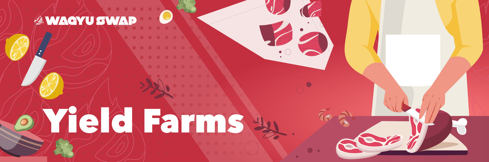

# 🚜 Yield Farming

## Yield Farming

Liquidity Providers can earn $WAG  by locking their LP tokens into a smart contract. This added incentive means to address the risk of [impermanent loss](https://trustwallet.com/blog/what-is-impermanent-loss) that is part and parcel of providing liquidity in a DEX. \(Please remember to always do your own research.\)

## Calculating the Rewards

The WagyuSwap Yield Farm APR calculations include the rewards earned through being a liquidity provider and the rewards earned through staking LP Tokens.

The rewards are generated per block and distributed to each user based on their deposited amount at the end of each block.

For example, in the WAG-VLX farming pool, 1 $WAG is generated as the reward per block.

After 100 blocks are generated on the Velas chain, 100 $WAG are distributed to users based both on the amount they deposited and how long they deposited for.

If Gordon deposited 10 WAG-VLX LP and Heston deposited 15 WAG-VLX LP, of the 100 $WAG distributed as rewards, Gordon gets 40 WAG and Heston gets 60 WAG.

As more users lock more LP tokens, the APR will drop according to the proportion in which these new tokens are added.

