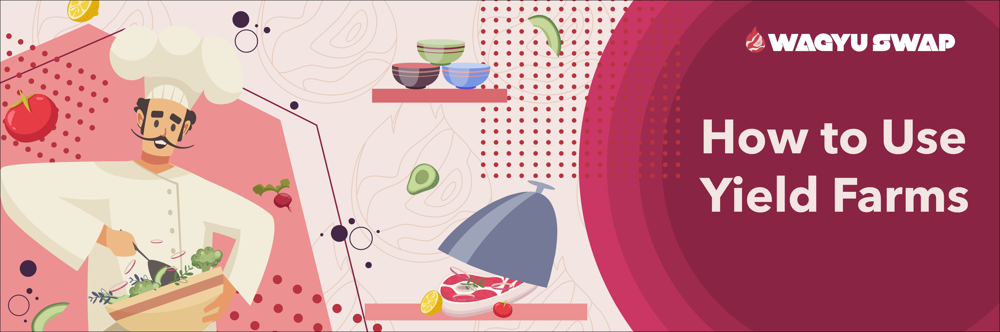
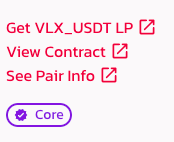
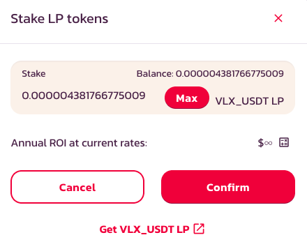
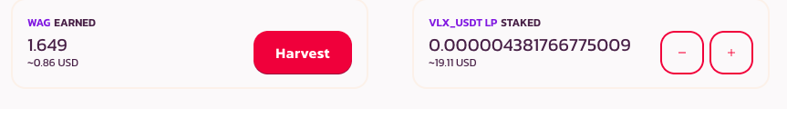
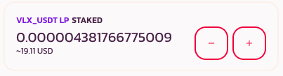
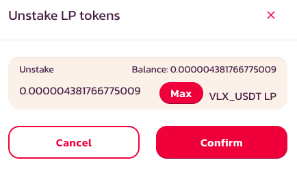
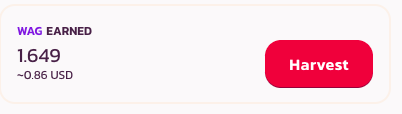

# How to Use Farms

### Let's get Farming!

After you provide Liquidity on WagyuSwap, you can take your LP tokens and stake them to get yourself some extra $WAG.

### Providing liquidity to get LP Tokens

After you select the farm you want to use – either by APR or simply because you want to hold the tokens in question – you will need to add liquidity to get your LP Tokens.

First, click on the Farm you've chosen to open up its window. If you don't already have the required LP token, click on "Get \(token pair\) LP" which will open up the "Add Liquidity" page.

Luckily for you, we have a guide for that too.

## Putting your LP Tokens into a Farm

You are now ready to farm your LP tokens.

Go to your chosen farm, click on it to expand it and hit the "Enable" button, followed by confirmation of that action in your wallet.

Wait until that button turns into "Stake LP" and click on it.

Type in the exact amount of LP tokens you want to stake or hit "Max" if you want to stake them all. At that point, click on "Confirm" and then follow through with that confirmation on your wallet.  

You will then be able to see both your staked LP tokens as well as how much $WAG they've earned you.

If you decide you'd like to add more tokens, just repeat the process described above. 

## Removing your LP tokens from a Farm

Go to the Farms page and click on the Farm you have LP tokens in. Once it expands, click on the "-" button to remove your LP tokens.

When the window appears, choose how many tokens you'd like to remove, hitting "Max" if you'd like to remove them all. Then, hit "Confirm" and confirm the action in your wallet too.

Once your LP tokens have been unstaked, the $WAG rewards you've accrued will also have been automatically harvested and will appear in your wallet.

## Harvesting your farming rewards

As your LP tokens earn you $WAG, you can choose how often you'd like to harvest them – and what you'd like to do with your new tokens.

Harvesting your $WAG is pretty simple. Just go to the relevant Farm where you have staked your LP tokens, click on it and once it expands, hit "Harvest." 

At this point you'll have to confirm the action in your wallet. Remember that each time you harvest will incur a transaction fee, which although incredibly low, is still a cost to bear in mind.

Don't know what to do with your freshly harvest $WAG? 

Then read on, dear budding Chef, as we're about to show you how you put your $WAG to work for you in one of our sizzling staking pools.

